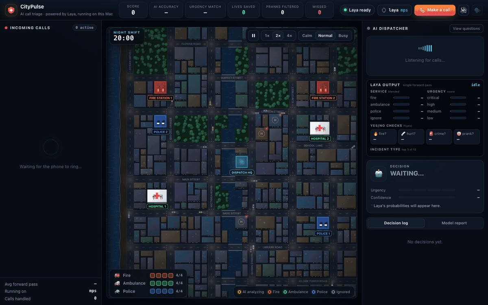
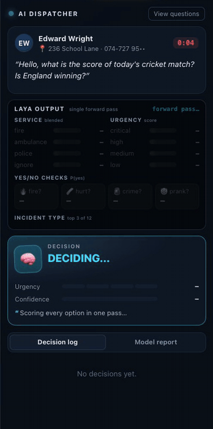
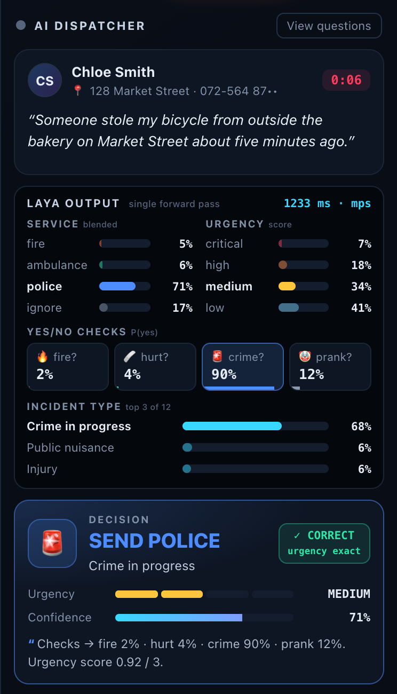
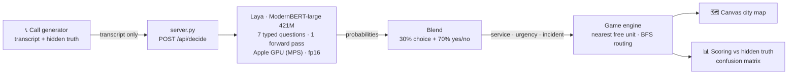
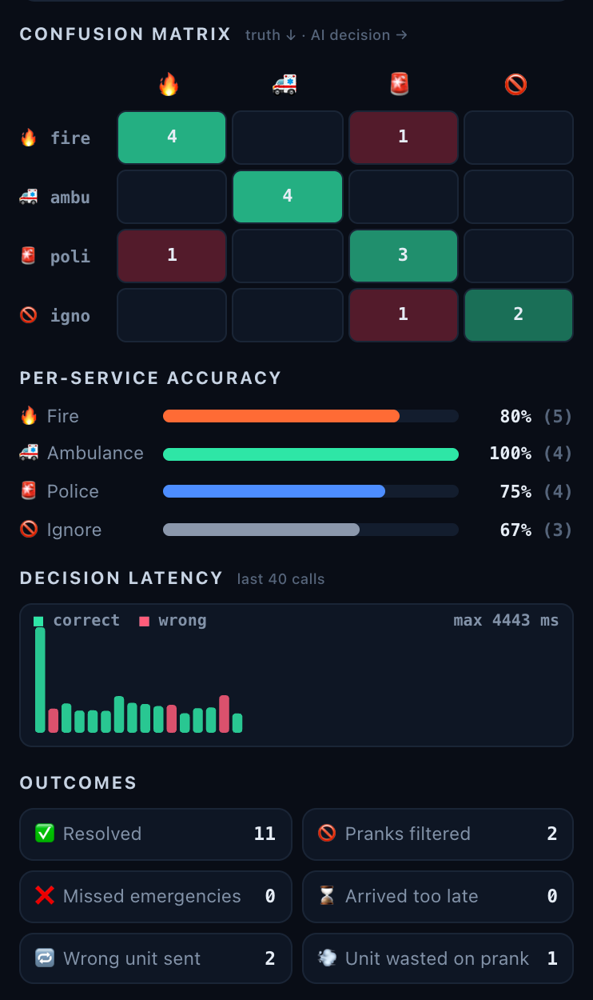

<div align="center">

# 🚨 CityPulse: Laya Dispatch

**Emergency call triage in one forward pass, running locally on a MacBook.**

An auto-playing city dispatch game where every incoming emergency call is triaged by
[**Laya**](https://huggingface.co/convaiinnovations/laya), a non-generative decision model
that answers typed questions with calibrated probabilities. No LLM, no text generation, no cloud.


[](LICENSE)



<sub>Calls ring in → Laya scores every option → the nearest free unit drives across the city → the outcome is scored against hidden ground truth.</sub>

**[▶ Watch the full 50-second demo (MP4)](docs/media/demo.mp4)**

</div>

---

## ✨ What it shows

| | |
|---|---|
| 📞 **Live call queue** | Scripted English emergency calls (fires, crashes, break-ins, snake bites) plus prank calls, each with a hidden ground truth the model never sees. |
| 🧠 **Transparent AI decisions** | For every call, Laya answers 7 typed questions in **one forward pass**. The UI shows the full probability distribution, not just a label. |
| 🗺️ **Simulated city** | Procedurally generated night city with a coast, river, bridges, traffic, 6 emergency stations and a dispatch HQ. Units route with BFS pathfinding and run with sirens. |
| 📊 **Honest evaluation** | Live accuracy, urgency match, a confusion matrix, per-service accuracy and latency. Wrong units radio back and get re-dispatched. |
| ✍️ **Try it yourself** | Press `C` and type any emergency. Laya triages it like the rest. |

<table>
<tr>
<td width="50%" align="center"><br><sub><b>Laya's output, live</b>: listen → one forward pass → decision</sub></td>
<td width="50%" align="center"><br><sub><b>One decision</b>: blended service probabilities, yes/no checks, urgency score, incident type</sub></td>
</tr>
</table>

## 🧠 How Laya makes the decision

Laya ([convaiinnovations/laya](https://huggingface.co/convaiinnovations/laya)) is a *System 1* decision model:
a ModernBERT-large encoder with a decision head. It is given the call (`state`) plus **typed questions**
and scores every option at its own `[MASK]` token, returning a probability per option in a single pass.
It never generates text, so there's nothing to parse and nothing to hallucinate.

Each call is sent with 7 questions ([`server.py`](server.py)):

| Question | Type | Used for |
|---|---|---|
| `service` | choice: fire / ambulance / police / ignore | who to send |
| `is_fire`, `is_hurt`, `is_crime`, `is_prank` | yes / no | evidence for each service |
| `urgency` | ordinal score 0–3 | critical / high / medium / low |
| `incident` | choice over 12 incident types | the label on the map |

The final service is a simple blend, `0.3 × choice + 0.7 × matching yes/no check`, because the base
checkpoint is strongest on NLI-style yes/no questions. The app's **View questions** button shows the exact
questions and the last raw answer from the model.



## 📊 Results

Measured on a MacBook Air (M2, 8 GB) over the game's 62 scripted calls:

| Setup | Service accuracy | Urgency (exact) | Urgency (±1 level) | Latency / call |
|---|---|---|---|---|
| Laya zero-shot, single 4-way choice | 82% | 45% | – | ~190 ms (2 questions) |
| **Final: choice + yes/no blend, score urgency** | **95%** | **56%** | **95%** | **~0.55–1.1 s** (7 questions) |
| Final, on 12 held-out calls not used for tuning | 11 / 12 | – | – | – |

<p align="center"></p>

> **Honest caveat:** the question wording and the blend weight were tuned on the same 62 calls, so
> 95% is optimistic. The model is **not** fine-tuned, and the ground truth is never sent to it.
> This is a demo of the model, not a real dispatch system: a real deployment would need fine-tuning
> on real calls, speech-to-text, multi-service incidents and a human in the loop.

## ⚙️ Engineering notes

- **Runs on an 8 GB Mac.** MPS already computes in fp16 (autocast), so weights are stored in fp16 too:
  memory drops from ~1.6 GB to **~0.87 GB** with **identical outputs** (max probability difference 0.0 on all 62 calls).
- **Fixed a Metal crash.** fp16 weights plus a call with fewer than 5 questions made Laya skip autocast, so fp32
  inputs met fp16 weights and Metal aborted the process. Autocast is now forced on for every call (`LAYA_MPS_AMP_MIN_ROWS=1`).
- **Latency spikes from memory pressure.** With calls ~9 s apart, macOS paged the idle model out and latency
  jumped to 1.6–7.7 s. A light keep-warm pass while the game runs brought it back to ~0.55–1.1 s.
- **No build step.** The frontend is vanilla ES modules and Canvas 2D (static city pre-rendered to an offscreen
  canvas, dynamic layer drawn each frame). The server is Python's standard `http.server` with Laya in-process.

## 🚀 Run it

Requires macOS on Apple Silicon (it also runs on CPU, but slowly) and Python 3.12+.

```bash
git clone https://github.com/<your-username>/CityPulse.git
cd CityPulse
./start.sh
```

On the first run `start.sh` creates `.venv/`, installs the locked versions from `requirements.txt`, downloads the Laya checkpoint
(~800 MB) from Hugging Face, and opens <http://localhost:8080>. Click **Start shift** and it plays itself.

| Key | Action |
| --- | --- |
| `Space` | pause / resume |
| `C` | make your own call (type any English emergency) |
| `1` `2` `4` | game speed |
| `M` / `V` | sound / read calls aloud |

Options: `PORT=9000 ./start.sh`, `LAYA_DEVICE=cpu ./start.sh`, `LAYA_KEEP_WARM=0 ./start.sh`,
or add `?seed=7` to the URL for a different city.

## 🗂️ Project structure

```
server.py            runs Laya in-process · POST /api/decide → agent.predict(state, QUESTIONS) → blend
start.sh             one-command setup + launch
requirements.txt     locked dependency versions (laya 0.3.21, torch 2.14.0, transformers 5.17.0)
public/index.html    layout: call queue · city map · AI panel
public/js/calls.js   scripted English calls + hidden ground truth (never sent to the model)
public/js/ai.js      client for /api/decide
public/js/game.js    simulation: queue → Laya → dispatch → travel → on-scene → score
public/js/city.js    procedural city (coast, river, roads, stations) + BFS pathfinding
public/js/render.js  canvas renderer: night city, sirens, fire and smoke, routes
public/js/ui.js      probability bars, decision log, confusion matrix, latency chart
```

## 🔭 Next steps

- Fine-tune Laya on a few thousand labelled calls (the Laya repo ships a Kaggle notebook for this), mainly to improve urgency.
- Evaluate on a larger held-out set written independently of the tuning set.
- "Assist mode": show Laya's suggestion to a human dispatcher and flag low-confidence calls for review.
- Speech-to-text input and multi-service incidents (e.g. a fire with injuries needs fire **and** ambulance).

## 🙏 Credits

- Built by **Rohan De Silva**
- Decision model: [Laya](https://huggingface.co/convaiinnovations/laya) by Convai Innovations (Apache-2.0) · [GitHub](https://github.com/NandhaKishorM/laya)
- Everything else (game, city generator, renderer, UI, evaluation) is original to this project.

## 📄 License

© 2026 Rohan De Silva. This project is released under the [MIT License](LICENSE).
The Laya model is a separate project, licensed under Apache-2.0 by Convai Innovations, and is downloaded at runtime (not included in this repo).
